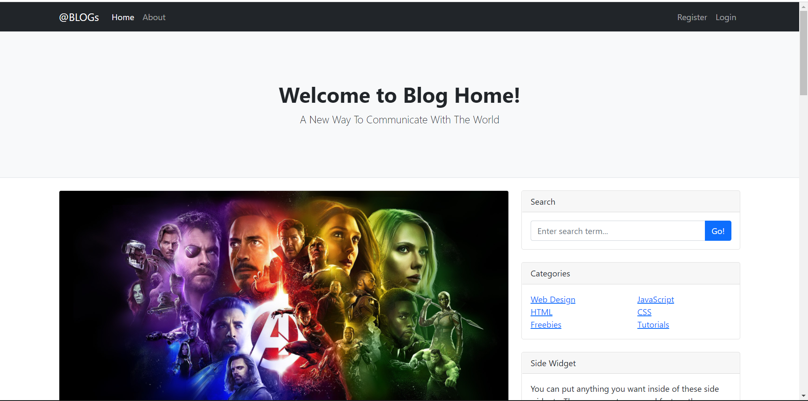
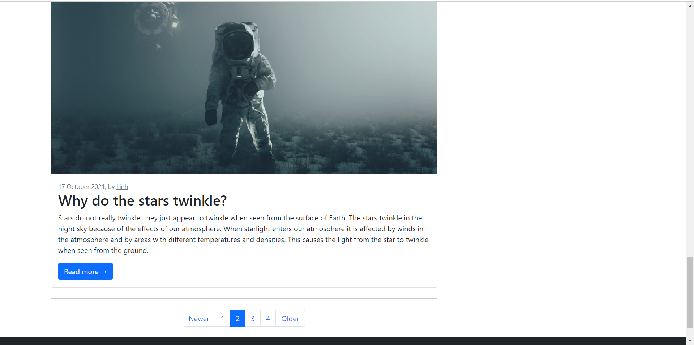
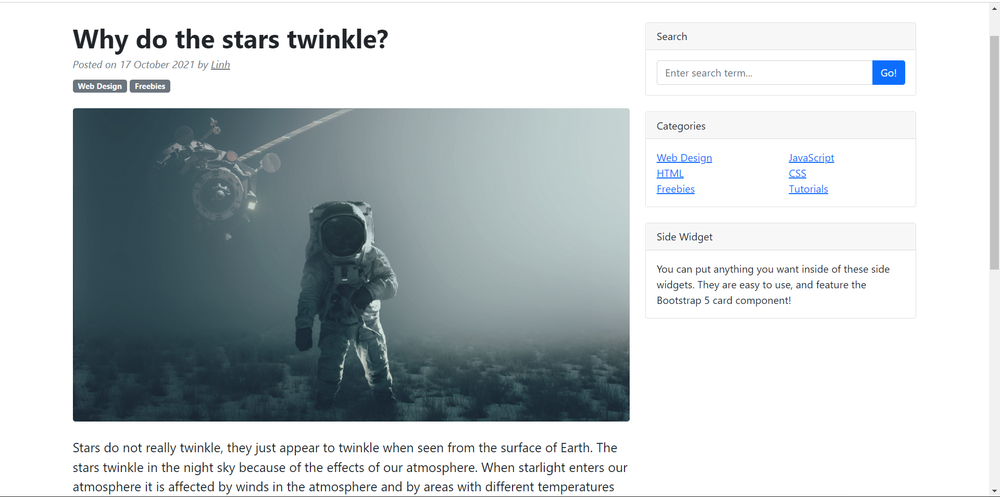

<!-- PROJECT LOGO -->
 

  <h3 align="start">Blog</h3>

  

    A basic Blog Website using Bootstrap and Django.
  

<!-- ABOUT THE PROJECT -->
## About The Project

  This is a basic blog website where users can register and write blogs about stuff. <b>Boorstrap</b> is used for designing the website and <b>Django</b> is used for the backend.

                                                                               
### Built With

* [Bootstrap](https://getbootstrap.com/)
* [Django](https://www.djangoproject.com/)

<!-- ACKNOWLEDGMENTS -->
## Acknowledgments

Thanks to the YouTube channel <a href="https://www.youtube.com/c/Coreyms">Corey Schafer<a/a> for the tutorials.

